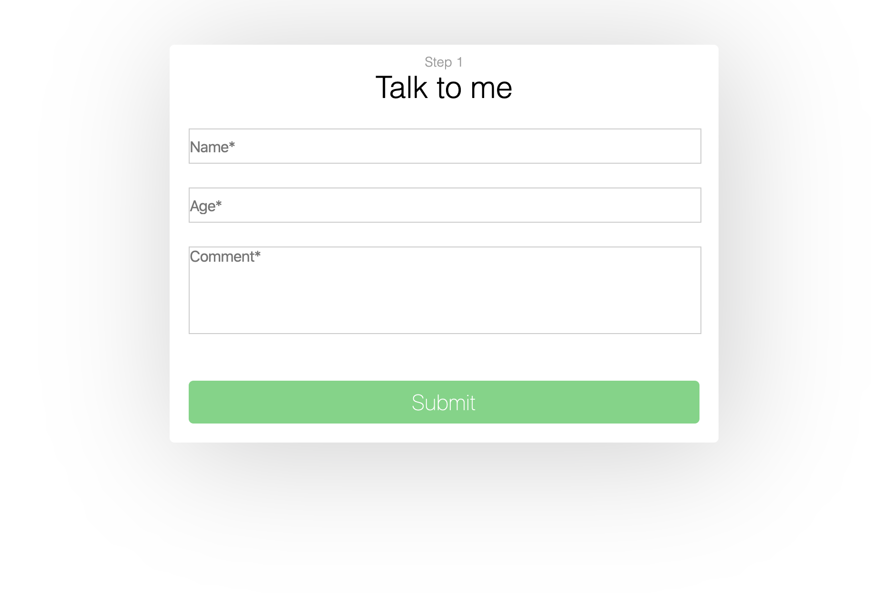
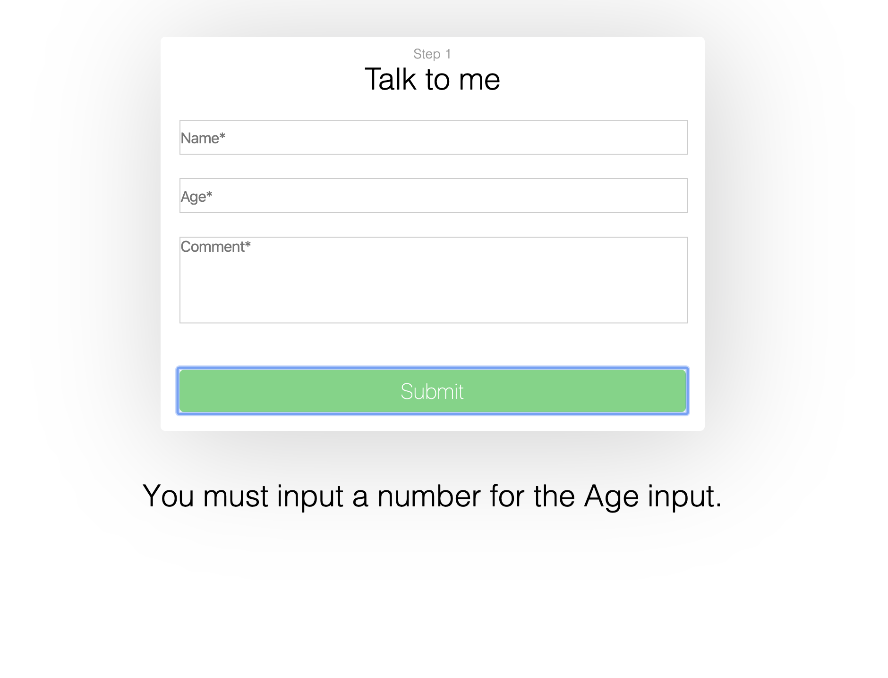
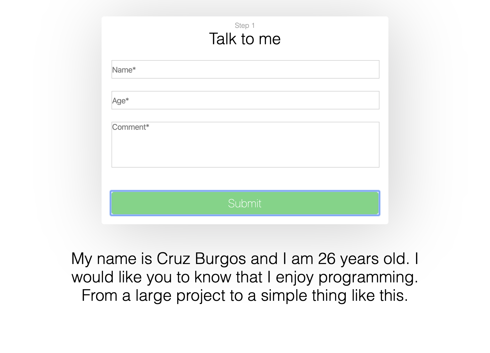
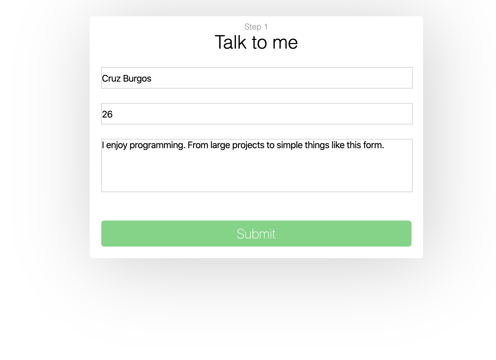

# React-Hooks-Form
Created with CodeSandbox

Screen on arrival:

When you fill out the form:

When you fill out the form correctly and click the submit button.
Screen on arrival:

When you fill out the form incorrectly and click the submit button.

